# 从Hello world开始搭建一个C++工程项目

说明：本工程项目参考哔哩哔哩up主[花不成57](https://space.bilibili.com/405472553)在B站上的视频及其在github上的项目[start_A_c_cpp_project](https://github.com/jinfeihan57/start_A_c_cpp_project) 整理而来，供自己学习参考使用，如侵必删。

本工程使用的相关工具有：

- 操作系统：Manjaro 22.1.0 Talos

- gcc/g++

  ```bash
  # 安装命令
  sudo pacman -S gcc
  ```

- cmake

  ```bash
  # 安装命令
  sudo pacman -S cmake
  ```

- git

  ```bash
  # 安装命令
  sudo pacman -S git
  ```

# 将项目同步到GitHub

[github文档](https://docs.github.com/zh/authentication/keeping-your-account-and-data-secure/managing-your-personal-access-tokens)

[github访问卡慢问题](https://gitee.com/klmahuaw/GitHub520)

## 解决GitHub访问慢的问题

最新的hosts文件地址：https://raw.hellogithub.com/hosts

```bash
# GitHub520 Host Start
140.82.114.26                 alive.github.com
140.82.113.5                  api.github.com
185.199.110.153               assets-cdn.github.com
185.199.111.133               avatars.githubusercontent.com
185.199.111.133               avatars0.githubusercontent.com
185.199.111.133               avatars1.githubusercontent.com
185.199.111.133               avatars2.githubusercontent.com
185.199.111.133               avatars3.githubusercontent.com
185.199.111.133               avatars4.githubusercontent.com
185.199.111.133               avatars5.githubusercontent.com
185.199.111.133               camo.githubusercontent.com
140.82.112.22                 central.github.com
185.199.111.133               cloud.githubusercontent.com
140.82.114.9                  codeload.github.com
140.82.113.22                 collector.github.com
185.199.111.133               desktop.githubusercontent.com
185.199.111.133               favicons.githubusercontent.com
140.82.112.3                  gist.github.com
52.217.0.75                   github-cloud.s3.amazonaws.com
52.217.124.1                  github-com.s3.amazonaws.com
52.217.74.140                 github-production-release-asset-2e65be.s3.amazonaws.com
52.217.129.225                github-production-repository-file-5c1aeb.s3.amazonaws.com
52.217.39.28                  github-production-user-asset-6210df.s3.amazonaws.com
192.0.66.2                    github.blog
140.82.114.4                  github.com
140.82.114.17                 github.community
185.199.110.154               github.githubassets.com
151.101.1.194                 github.global.ssl.fastly.net
185.199.110.153               github.io
185.199.111.133               github.map.fastly.net
185.199.110.153               githubstatus.com
140.82.112.25                 live.github.com
185.199.111.133               media.githubusercontent.com
185.199.111.133               objects.githubusercontent.com
13.107.42.16                  pipelines.actions.githubusercontent.com
185.199.111.133               raw.githubusercontent.com
185.199.111.133               user-images.githubusercontent.com
13.107.253.40                 vscode.dev
140.82.114.22                 education.github.com


# Update time: 2023-08-05T14:52:22+08:00
# Update url: https://raw.hellogithub.com/hosts
# Star me: https://github.com/521xueweihan/GitHub520
# GitHub520 Host End

```

修改`host`文件：

```bash
# 切换 root 用户
su root
# 编辑 hosts 文件
vi /etc/hosts

# 将上述内容追加到 hosts 文件末尾
```

激活生效：

```bash
sudo systemctl restart nscd.service
```


## 新建GitHub仓库

登陆GitHub，新建一个名为`0_CreateCppProjectFromHelloWorld`的仓库

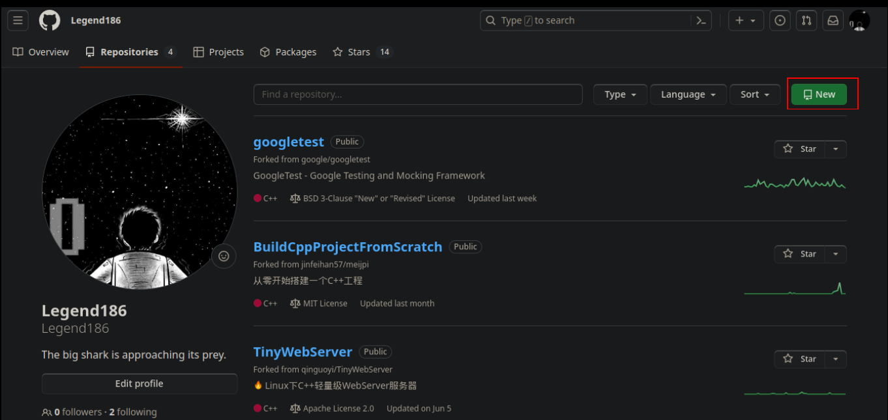

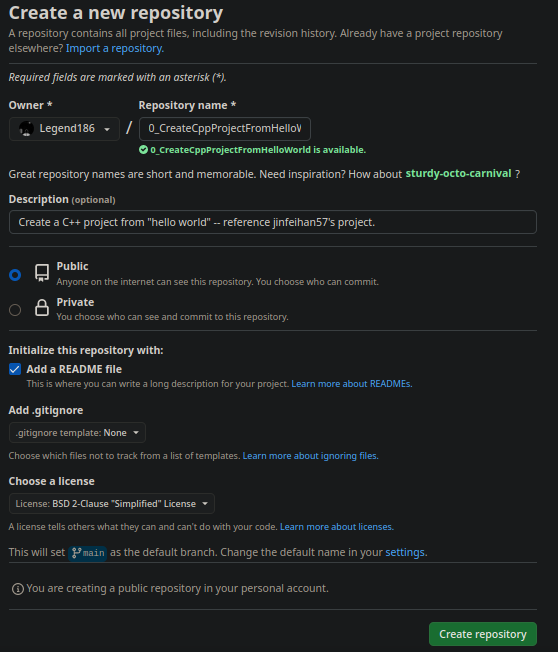

如下图，仓库创建成功

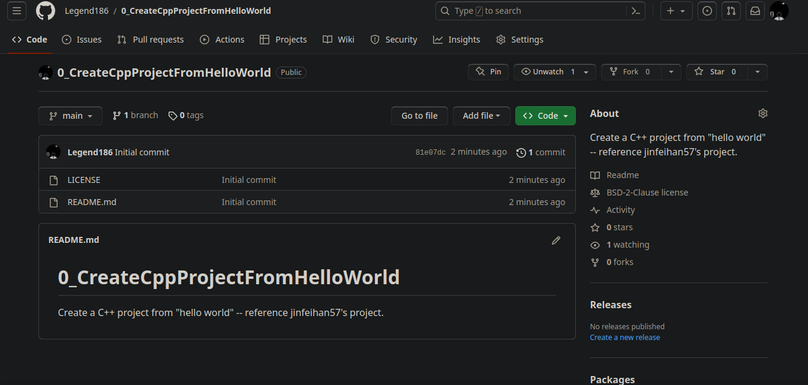

## 利用 SSH 完成 Git 与 GitHub 的绑定

在 GitHub 上，一般都是通过 SSH 来授权的，而且大多数 Git 服务器也会选择使用 SSH  公钥来进行授权，所以想要向 GitHub 提交代码，首先就得在 GitHub 上添加 SSH key配置。

### step1：生成SSH key

要想生成SSH key，首先就得先安装 SSH，对于 Linux 和 Mac 系统，其默认是安装 SSH 的。

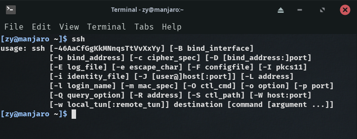

输入`ssh-keygen -t rsa`命令，表示我们指定 RSA  算法生成密钥，然后敲三次回车键，期间不需要输入密码。

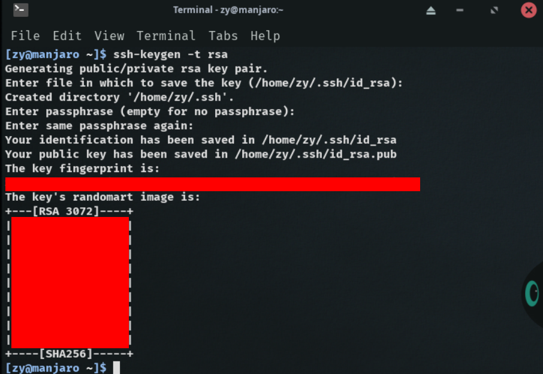

之后就会生成两个文件，分别为id_rsa和id_rsa.pub，即密钥`id_rsa`和公钥`id_rsa.pub`。这两个文件，都为隐藏文件，默认生成在以下目录：

```
Linux 系统：~/.ssh
Mac 系统：~/.ssh
Windows 系统：C:\Documents and Settings\username\\.ssh
Windows 10 ThinkPad：C:\Users\think\.ssh
```

密钥和公钥生成之后，我们要做的事情就是把公钥`id_rsa.pub`的内容添加到 GitHub，这样我们本地的密钥`id_rsa`和 GitHub 上的公钥`id_rsa.pub`才可以进行匹配，授权成功后，就可以向 GitHub 提交代码啦！

```bash
cd ~/.ssh
ls
cat id_rsa.pub
```

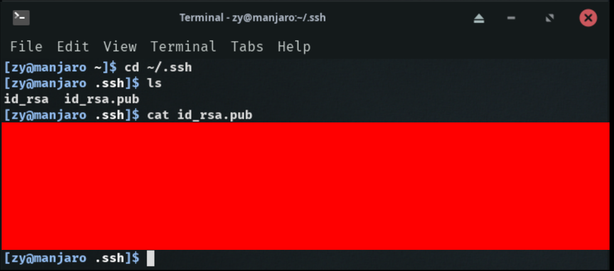

### step：添加SSH key

进入github主页，点击右上角个人头像，点击settings

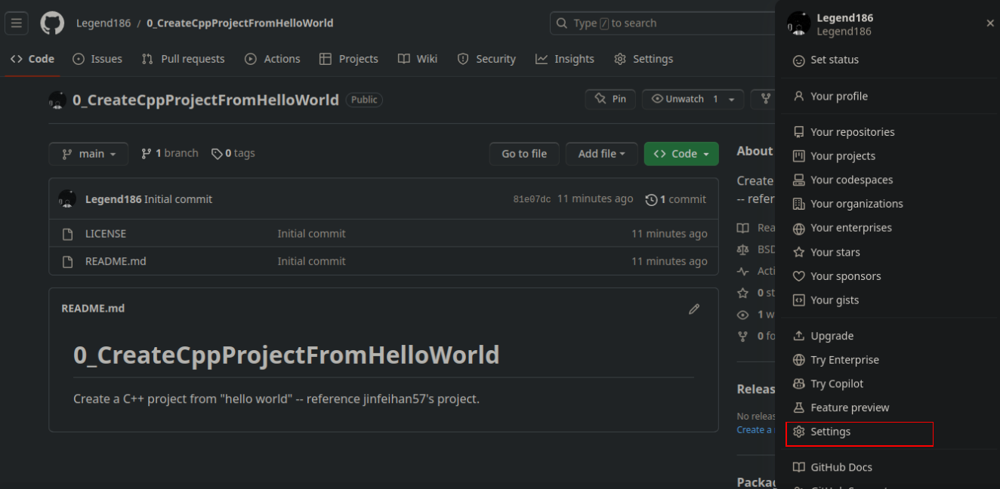

击SSH and GPG Keys进入如下界面，然后点击New SSH key按钮

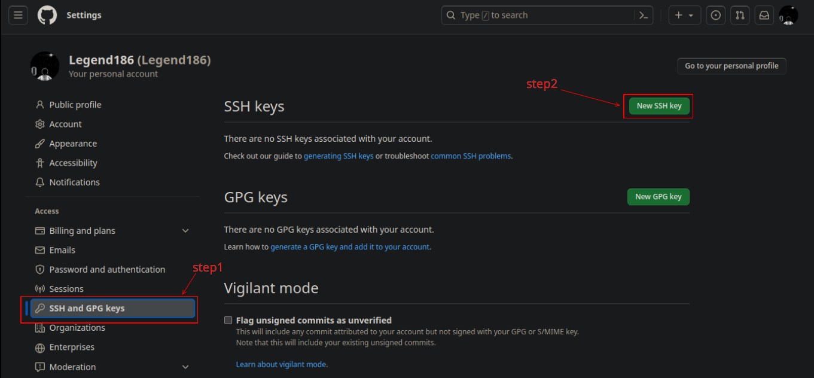

只需要将公钥`id_rsa.pub`的内容粘贴到Key处的位置（Titles的内容不填写也没事），然后点击`Add SSH key` 即可。

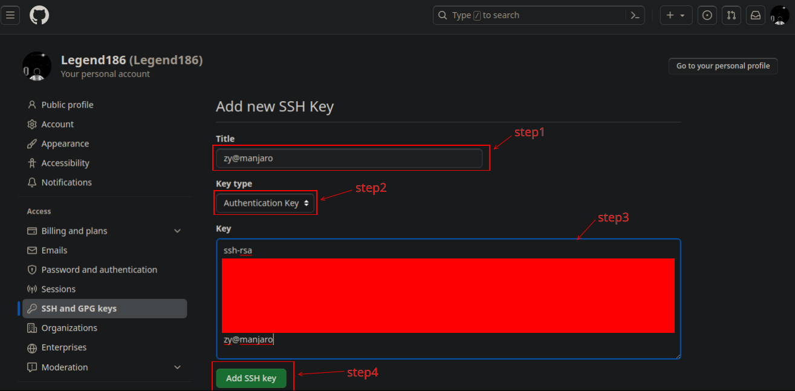

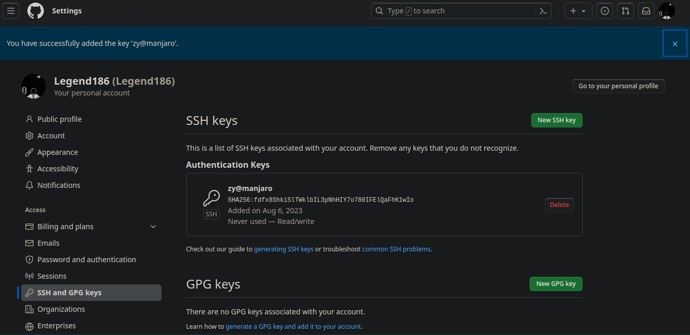

### step3：验证绑定是否成功

在添加完SSH key之后，也没有明确的通知告诉我们绑定成功啊！可通过在终端中输入`ssh -T git@github.com`进行测试：

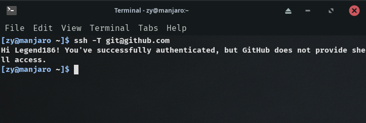

此时已经完成了本地Git与远程GitHub的绑定，可通过Git向GitHub提交代码了。

## 通过Git将代码提交到Github

在进行演示之前，需要先了解两个命令，分别为 `push` 和 `pull`

- `push`：该单词直译过来就是“推”的意思，若本地的代码有了更新，为保持本地与远程的代码同步，就需要把本地的代码推到远程的仓库

  ```bash
  # 示例
  git push origin master
  ```

- `pull`：该单词直译过来就是“拉”的意思，若远程仓库的代码有了更新，同样为了保持本地与远程的代码同步，就需要把远程的代码拉到本地

  ```bash
  # 代码示例
  git pull origin master
  ```

- `pull request`：如果我们fork了别人的项目（或者说代码），并对其进行了修改，想要把我们的代码合并到原始项目（或者说原始代码）中，我们就需要提交一个pull request，让原作者把我们的代码拉到 ta 的项目中，至少对于 ta 来说，我们都是属于远程端的。

一般情在`push`操作之前都会先进行`pull`操作，这样不容易造成冲突。

### 向GitHub提交代码

#### 本地无Git仓库

若本地没有 Git 仓库，则可以直接将远程仓库`clone`到本地。通过`clone`命令创建的本地仓库，其本身就是一个 Git  仓库了，不用我们再进行`init`初始化操作啦，而且自动关联远程仓库。我们只需要在这个仓库进行修改或者添加等操作，然后`commit`即可。

首先进入个人主页，点击`0_CreateCppProjectFromHelloWold`，进入`0_CreateCppProjectFromHelloWold`项目后，复制项目链接

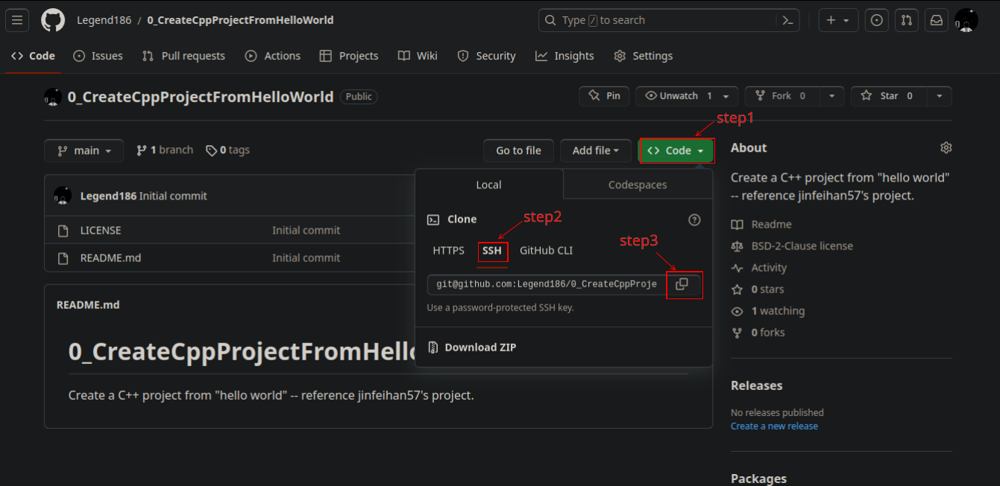

创建存放此项目的本地目录，使用`clone`命令将github上的项目复制到本地

```bash
git clone git@github.com:Legend186/0_CreateCppProjectFromHelloWorld.git
```

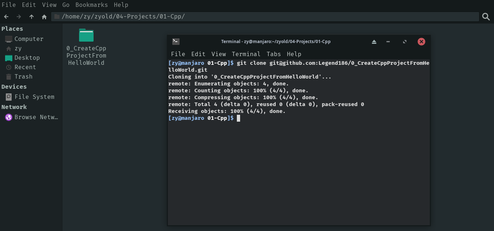

复制成功后，查看仓库状态

```bash
git status
```

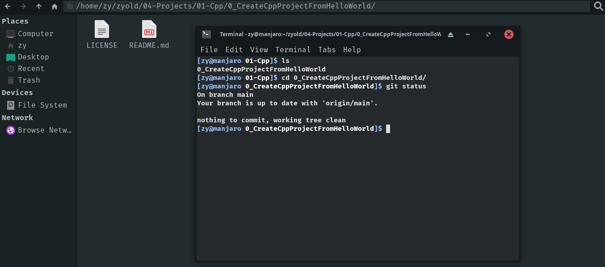

在真正提交代码前，需要先对要提交的文件进行追踪

```bash
# 所有文件
git add .

# 指定文件
git add xxx xxx xxx ...
```

如对文件`README.md`进行了修改

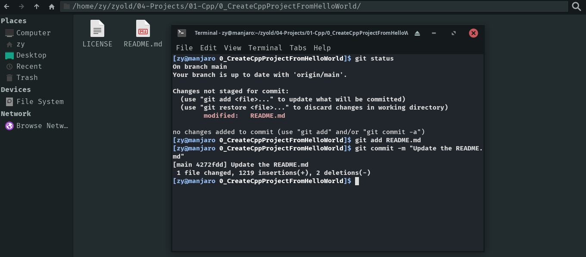

提交代码

```bash
git commit -m "xxxxxxx"
```

查看仓库日志

```bash
git log
```

再次查看仓库状态

```bash
git status
```

关联远程仓库

```bash
# git remote add <远程仓库名> <远程仓库的github地址>

git remote add 0_CreateCppProjectFromHelloWorld git@github.com:Legend186/0_CreateCppProjectFromHelloWorld.git
```

若报错`remote 0_CreateCppProjectFromHelloWorld already exists.`表明本地库已经关联了`0_CreateCppProjectFromHelloWorld`的远程库，可以使用如下命令解决

```bash
# 删除关联的 0_CreateCppProjectFromHelloWorld 的远程库
git remote rm 0_CreateCppProjectFromHelloWorld

# 与远程库进行关联，将库名命名为 0_CreateCppProjectFromHelloWorld
git remote add 0_CreateCppProjectFromHelloWorld git@github.com:Legend186/0_CreateCppProjectFromHelloWorld.git
```

使用如下命令将本地仓库的内容push到远程仓库。注意：第一次向远程仓库提交代码时，需输入账号和密码进行验证。

```bash
git push 0_CreateCppProjectFromHelloWorld main
```

git push过程中会**报错**：这是因为原先的密码凭证从2021年8月13日开始就不能使用，必须使用个人访问令牌（personal access token），即把密码替换成token。

令牌（token）与基于密码的身份验证相比，令牌提供了许多**安全优势**：

- 唯一性：令牌特定于 GitHub，可以按使用或按设备生成
- 可撤销：可以随时单独撤销令牌，而无需更新未受影响的凭据
- 有限性：令牌可以缩小范围以仅允许用例所需的访问
- 随机性：令牌不需要记住或定期输入的更简单密码可能会受到的字典类型或蛮力尝试的影响

**解决办法**：

- 登录自己的Github账号，在右上角点击头像，在下拉菜单上找到 **Setting**

- 点击左侧栏的**Developer settings**选项

- 点击左侧栏上的**Personal access tokens**选项，GitHub 建议尽可能使用 fine-grained personal access token 

  一步一步操作，将最终生成的token保存好，因为再次刷新网页的时候，已经没有办法看到它了。

- 使用token

  - 方式一：`git push`时，提示输入密码的位置输入token

  - 方式二：将token直接添加到远程仓库链接中，以避免同一个仓库每次提交代码都要输入token

    ```
    git remote set-url origin https://<your_token>@github.com/<USERNAME>/<REPO>.git
    ```


解决完token问题之后，进行提交

```bash
# 将本地仓库修改或添加的内容提交到远程仓库
git push 0_CreateCppProjectFromHelloWorld main
```

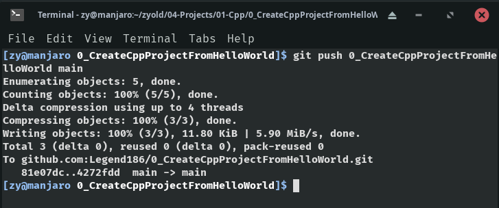


可以看到同步成功。

### 良好的git发布流程习惯

```bash
# 分支合并发布流程：
git add .			# 将所有新增、修改或删除的文件添加到暂存区
git commit -m "版本发布" # 将暂存区的文件发版
git status 			# 查看是否还有文件没有发布上去
git checkout xxxxx	# 切换到要合并的分支 xxxxx
git pull 0_CreateCppProjectFromHelloWorld main			# 在test 分支上拉取最新代码，避免冲突
git merge main   	# 在 main 分支上合并 xxxxx 分支上的代码
git push 0_CreateCppProjectFromHelloWorld main	# 上传 main 分支代码
```


#### 本地已有git仓库

##### 创建一个git仓库

```bash
# 创建一个目录
mkdir 0_CreateCppProjectFromHelloWorld

# 使用 0_CreateCppProjectFromHelloWorld 作为git仓库
cd 0_CreateCppProjectFromHelloWorld
git init
```

##### 项目目录

```
0_CreateCppProjectFromHelloWorld
```

[TODO]

# Hello world 项目

## hello_world_0_origin

最原始的`hello_world`是将代码写在一个文件的一个函数中。

### 项目目录

```bash
0_CreateCppProjectFromHelloWorld
|
|____hello_world_0_origin
		|__main.cpp
```


### 源代码

- `main`函数

  ```cpp
  /*
  filename：main.cpp
  content：简单的打印 "Hello world!" 至终端
  author：Legend186
  version：v1.0
  */
  
  #include <iostream>
  
  int main()
  {
      std::cout << "Hello world!" << std::endl;
      
      return 0;
  }
  ```

  

### build

```bash
# 编译、链接
g++ -o hello_world_0_origin main.cpp

# 执行可执行文件
./hello_world_0
```

### git提交

```bash
# 将 hello_world_0_origin 路径及其下的内容纳入版本控制
cd 0_CreateCppProjectFromHelloWorld
git add .

# 提交
git commit -m "Release version 1.0.0 The original Hello_world project which has only one file contains the function main."

# 同步远程仓库的main分支
git pull 0_CreateCppProjectFromHelloWorld main

# push到远程仓库的main分支
git push 0_CreateCppProjectFromHelloWorld main


# 对 当前提交的内容打附注标签
git tag -a hello_world_0_origin -m "Release version 1.0.0" HEAD
# 将标签推送至远程仓库
git push 0_CreateCppProjectFromHelloWorld hello_world_0_origin

# 查看所有标签
git tag -l

# 切换到该标签
git checkout hello_world_0_origin
```


### 弊端

将所有功能都写在一个文件的一个函数中，会导致各个功能块**耦合**严重，后期维护困难，随着业务复杂度的提高，main函数体积迅速膨胀，导致逻辑不清晰，功能责任田混乱，团队合作困难。不要说大项目，连小项目也难以开发。

## hello_world_1_decoupling

将一个函数按功能拆分成多个函数，在`main`函数中来调用这些函数，来实现初步的解耦合。

### 项目目录

```bash
0_CreateCppProjectFromHelloWorld
|
|____hello_world_1_decoupling
		|__main.cpp
```


### 源代码

- `main`函数

```cpp
/*
filename：main.cpp
content：将 hello_world_0_origin 按功能拆分成2个函数，以实现初步解耦合的，功能还是打印 "Hello world!" 至终端
	Hello函数：只打印 "Hello "
	World函数：只打印 "World!"和换行
    main函数：调用 Hello函数 和 World函数	
author：Legend186
version：v1.0
*/

#include <iostream>

int Hello();
int World();

int main()
{
    Hello();
    World();
    
    return 0;
}

int Hello()
{
    std::cout << "Hello ";
    
    return 0;
}

int World()
{
    std::cout << "world!" << std::endl;
    
    return 0;
}
```

### build

```bash
# 编译、链接
g++ -o hello_world_1_decoupling main.cpp

# 执行
./hello_world_1_decoupling
```

### git提交

```bash
# 将 hello_world_1_decoupling 目录纳入到版本控制
cd 0_CreateCppProjectFromHelloWorld
git add.

# 提交
git commit -m "Release version 1.0.1 The second Hello_world project which has only one file but contains 2 functions besides the main function."

# 同步远程仓库的main分支
git pull 0_CreateCppProjectFromHelloWorld main

# push到远程仓库的main分支
git push 0_CreateCppProjectFromHelloWorld main

# 对 当前提交的内容打附注标签
git tag -a hello_world_1_decoupling -m "Release version 1.0.1" HEAD
# 将标签推送至远程仓库
git push 0_CreateCppProjectFromHelloWorld hello_world_1_decoupling
```


### 弊端

所有的功能还是只在`main.cpp`文件中完成的，随着业务复杂度的提高，会导致`main.cpp`中的函数数量大幅增加，代码行数也迅速膨胀，仍旧不适合团队之间的合作开发

## hello_world_2_decoupling

将`hello_world`项目进行拆分，根据不同的模块不同的功能，划分了各自的责任。

`Hello()`只在hello目录内实现，`World()`只在world目录内实现。这样就可以安排团队1去开发Hello模块，团队2去开发World模块，团队3去开发main模块进行hello和world模块的调用即可，各个团队之间是解耦合的。

### 项目目录

```bash
0_CreateCppProjectFromHelloWorld
|
|__hello
|	|__hello.h
|	|__hello.cpp
|
|__world
|	|__world.h
|	|__world.cpp
|
|__main.cpp
```


### 源代码

- `hello`目录

  - `hello.h`

    ```cpp
    /*
    filename：hello.h
    content：声明 Hello 函数
    author：Legend186
    version：v1.0
    */
    #ifndef _HELLO_H_
    #define _HELLO_H_
    
    int Hello();
    
    #endif
    ```

  - `hello.cpp`

    ```c++
    /*
    filename：hello.h
    content：定义 Hello 函数
    author：Legend186
    version：v1.0
    */
    
    #include "hello.h"
    #include <iostream>
    
    int Hello()
    {
        std::cout << "Hello ";
        
        return 0;
    }
    ```

- `world`目录

  - `world.h`

    ```c++
    /*
    filename：world.h
    content：声明 World 函数
    author：Legend186
    version：v1.0
    */
    
    #ifndef _WORLD_H_
    #define _WORLD_H_
    
    int World();
    
    #endif
    ```

  - `world.cpp`

    ```c++
    /*
    filename：world.h
    content：定义 World 函数
    author：Legend186
    version：v1.0
    */
    
    #include "world.h"
    #include <iostream>
    
    int World()
    {
        std::cout << "world!" << std::endl;
        
        return 0;
    }
    
    ```

- `main`函数

  ```c++
  /*
  filename：main.h
  content：定义 main 函数
  author：Legend186
  version：v1.0
  */
  
  #include "hello/hello.h"
  #include "world.h"
  /*
  此处未指明world.h所在的目录 #include "world/world.h" ，会导致编译时找不到world.h
  补救措施：
  1.g++编译时-I参数的使用
  2.使用cmake工具编写CMakefileLists.txt时add_include_directory()的使用
  */
  
  int main()
  {
      Hello();
      World();
      
      return 0;
  }
  ```

### build

```bash
# 编译、链接 1
g++ -o hello_world_2_decoupling main.cpp hello/hello.cpp world/world.cpp -I ./world
# -I：指定编译时可从其后跟的参数（路径）去搜索头文件
# ./world：-I参数指定的要搜索的头文件路径 .表示当前路径（即main.cpp所在的路径），./world 即表示当前路径下的world目录；在编译前3个文件时，优先在 ./world 目录下去寻找依赖的头文件

# 编译、链接 2
# 将 main.cpp 编译成 main.o
g++ -c main.cpp -I ./world
# 将 hello.cpp 编译成 hello.o
g++ -c hello/hello.cpp
# 将 world.cpp 编译成 world.o
g++ -c world/world.cpp
# 将 main.o、hello.o生成动态库 libworldlib.so 和 libhellolib.so 
g++ -o hello_world_2_decoupling main.o hello.o world.o
```

### git提交

```bash
# 将 hello_world_1_decoupling 目录纳入到版本控制
cd 0_CreateCppProjectFromHelloWorld
git add .

# 提交
git commit -m "Release version 1.0.2 The second Hello_world project which has the two new file paths and each path only contains the files which only realize one function"

# 同步远程仓库的main分支
git pull 0_CreateCppProjectFromHelloWorld main

# push到远程仓库的main分支
git push 0_CreateCppProjectFromHelloWorld main

# 对 当前提交的内容打附注标签
git tag -a hello_world_2_decoupling -m "Release version 1.0.2" HEAD
# 将标签推送至远程仓库
git push 0_CreateCppProjectFromHelloWorld hello_world_2_decoupling
```


### 弊端

引入了编译操作复杂、低效的问题。

## hello_world_3_makefile

为解决编译操作复杂、低效的问题，引入了新的工具makefile。

### 项目目录

```bash
0_CreateCppProjectFromHelloWorld
|__hello
|	|__hello.h
|	|__hello.cpp
|
|__world
|	|__world.h
|	|__world.cpp
|
|__main.cpp
|__Makefile
```


### 源代码

项目目录与源代码与`hello_world_2_decoupling`一致，仅是增加了一个Makefile文件，此Makefile文件的实际执行步骤与`hello_world_2_decoupling`第二个编译方法一致，因此实现了对编译方法二的四个编译步骤进行了管理。

同时make命令会监测编译所需要的依赖是否是最新的，若依赖未进行修改，则生成目标即是最新的，无需修改，也就无需重新编译。

- Makefile

  ```makefile
  # Makefile
  
  # make的原理
  # 以冒号作为分隔，冒号前为target，冒号后为dependence；换行<tab>键，其后为command，即
  # <atrget>: <dependence1> <dependence2> ...
  # <tab> command
  
  # 要想生成hello_world_3_makefile，依赖main.o hello.o world.o这三个.o文件，使用这三个.o文件执行下面的 g++ 命令即可生成要想生成hello_world_3_makefile
  # 会实现自动的递归关系：此处编译时需要main.o，但此时没有main.o，因此会去下面找main.o，生成main.o又依赖......
  hello_world_3_makefile: main.o hello.o world.o
  	g++ -o hello_world_3_makefile main.o hello.o world.o
  
  main.o: main.cpp hello/hello.h world/world.h
  	g++ -c main.cpp -I ./world
  	
  hello.o: hello/hello.cpp hello/hello.h
  	g++ -c hello/hello.cpp
  	
  world.o: world/world.cpp world/world.h
  	g++ -c world/world.cpp
  	
  clean:
  	rm -rf main.o hello.o world.o
  ```

### build

```bash
# 执行make命令即可
make

# 执行生成的可执行文件
./hello_world_3_makefile
```

### git提交

```bash
# 将 hello_world_3_makefile 目录纳入到版本控制
cd 0_CreateCppProjectFromHelloWorld
git add .

# 提交
git commit -m "Release version 1.0.3 use the tool——makefile to compile the project"

# 同步远程仓库的main分支
git pull 0_CreateCppProjectFromHelloWorld main

# push到远程仓库的main分支
git push 0_CreateCppProjectFromHelloWorld main

# 对 当前提交的内容打附注标签
git tag -a hello_world_3_makefile -m "Release version 1.0.3" HEAD

# 将标签推送至远程仓库
git push 0_CreateCppProjectFromHelloWorld hello_world_3_makefile
```


### 弊端

Makefile只能在类unix系统上使用，无法在windows系统上使用。但C/C++是跨平台的，只是因为构建方式导致项目跨平台失败显然是无法接受的。

为解决项目的跨平台编译问题，引入了cmake工具。

## hello_world_4_cmake

cmake：用于连接本地构建环境。执行cmake脚本会转换成makefile（linux）或vs studio的项目（windows），实现编译的跨平台，再执行make来执行编译过程。

对每一个含有`.cpp`的路径下，都需要编写`CMakeLists.txt`文件

### 项目目录

```bash
0_CreateCppProjectFromHelloWorld
|__hello
|	|__hello.h
|	|__hello.cpp
|
|__world
|	|__world.h
|	|__world.cpp
|
|__build
|__main.cpp
|__CMakeLists.txt
```

### 源代码

- 项目根目录下的`CMakeLists.txt`

  ```cmake
  # CMakeLists.txt
  
  # 指定 cmake 的最低版本
  cmake_minimum_required(VERSION 3.27.0)
  
  # 设置当前CMakeLists.txt的项目名
  project_name(hello_world_4_cmake)
  
  # 添加一个要生成的可执行程序
  # 第一个参数为target，即可执行程序的名字
  # 其它参数为要生成可执行程序的依赖
  add_executale(${PROJECT_NAME} hello/hello.cpp world/world.cpp)
  
  # 指定头文件的搜索路径
  # 第一个参数为target，即要生成的可执行程序 的名字
  # 第二个参数为，通常都为PUBLIC
  # 第三个参数为 路径名
  target_include_directories(${PROJECT_NAME} PUBLIC world)
  
  
  ```

- 其他内容及代码与`hello_world_3_makefile`的一致

### build

外部构建：将编译输出文件与源文件放在不同的目录下。

```bash
# 创建编译目录build并进入，编译生成的文件会放在build目录下
mkdir build && cd build

# 编译，cmake命令后跟的是根项目的CMakeLists.txt文件所在的目录路径，因为当前进入了build目录，因此CMakeLists.txt就位于上一级目录（.. 即表示上一级目录）
cmake ..

# 编译，打印编译的简要信息
make

# make为增量编译，清除之前的编译信息
make clean
# 或
rm * -rf

# 编译，打印详细信息
make VERBOSE=1
```

### git提交

```bash
# 将 hello_world_4_cnake 目录纳入到版本控制
cd 0_CreateCppProjectFromHelloWorld
git add .

# 提交
git commit -m "Release version 1.0.4 only the root directory has CMakeLists.txt file."

# 同步远程仓库的 main 分支
git pull 0_CreateCppProjectFromHelloWorld main

# 推送至远程仓库的 main 分支
git push 0_CreateCppProjectFromHelloWorld main

# 打附注标签
git tag -a hello_world_4_cmake -m "Release version 1.0.4" HEAD

# 将标签推送至远程仓库
git push 0_CreateCppProjectFromHelloWorld hello_world_4_cmake
```


### 弊端

所有的编译都放在了项目根路径下的`CMakeLists.txt`中，包括hello模块和world模块。若因业务变更，对hello模块进行了文件的增删，则就会来改动项目根路径下的`CMakeLists.txt`，此时若world模块也需要来修改此`CMakeLists.txt`，则会造成问题，就需要开发者之间进行沟通。

为解决编译耦合的问题，因此每个模块单独维护一个自己的`CMakeLists.txt`

## hello_world_5_cmake

### 项目目录

```bash
0_CreateCppProjectFromHelloWorld
|__hello
|	|__hello.h
|	|__hello.cpp
|	|__CMakeLists.txt
|
|__world
|	|__world.h
|	|__world.cpp
|	|__CMakeLists.txt
|
|__build
|__main.cpp
|__CMakeLists.txt
```

### 源代码

除`CMakeLists.txt`有变动之外，其他的代码均与`hello_world_4_cmake`一致。

- `hello/CMakeLists.txt`

  ```CMAKE
  # hello/CMakeLists.txt
  cmake_minumum_required(VERSION 3.27.0)
  
  # 设置当前项目的项目名为 hello
  project_name(hello)
  
  # 将 ${CMAKE_CURRENT_SOURCE_DIR}/hello.cpp 的值赋给变量 HELLO_SRC，若有多个则以空格隔离即可
  # CMAKE_CURRENT_SOURCE_DIR 为cmake的内置变量，代表当前CMakeLists.txt所在的路径
  set(HELLO_SRC ${CMAKE_CURRENT_SOURCE_DIR}/hello.cpp)
  
  # 添加一个库，库名为 hellolib，库的类型为SHARED（动态库），生成动态库的依赖为HELLO_SRC
  add_library(hellolib SHARED HELLO_SRC)
  ```

- `world/CMakeLists.txt`

  ```cmake
  # world/CMakeLists.txt
  cmake_required_minimum(VERSION 3.27.0)
  project_name(world)
  
  set(WORLD_SRC ${CMAKE_CURRENT_SOURCE_DIR}/world.cpp)
  
  add_library(worldlib SHARED WORLD_SRC)
  ```

- `CMakeLists.txt`

  ```cmake
  # CMakeLists.txt
  cmake_minimum_required(VERSION 3.27.0)
  project_name(hello_world_5_cmake)
  
  # 添加含有要编译的CMakeLists.txt文件的子文件夹
  add_subdirectory(hello)
  add_subdirectory(world)
  
  # 为项目添加一个要生成的可执行程序
  add_executable(${PROJECT_NAME} main.cpp)
  
  # 为项目添加需包含的头文件路径
  target_include_directories(${PROJECT_NAME} public world)
  
  # 为项目添加链接库
  target_link_libararies(${PROJECT_NAME} PUBLIC hellolib)
  target_link_libararies(${PROJECT_NAME} PUBLIC worldlib)
  ```

### build

```cmake
# 创建编译过程产生的文件路径并进入
mkdir build && cd build

# 编译主目录的CMakeLists.txt生成makefile文件
cmake ..

# 编译链接生成可执行程序
make

# 执行生成的可执行程序
./hello_world_5_cmake
```

### git提交

```bash
# 将 hello_world_5_cnake 目录纳入到版本控制
cd 0_CreateCppProjectFromHelloWorld
git add .

# 提交
git commit -m "Release version 1.0.5 each directory which has .cpp file has their only CMakeLists.txt file."

# 同步远程仓库的 main 分支
git pull 0_CreateCppProjectFromHelloWorld main

# 推送至远程仓库的 main 分支
git push 0_CreateCppProjectFromHelloWorld main

# 打附注标签
git tag -a hello_world_5_cmake -m "Release version 1.0.5" HEAD

# 将标签推送至远程仓库
git push 0_CreateCppProjectFromHelloWorld hello_world_5_cmake
```

## 开发过程回顾

在搭建初始的hello_world项目时，遇到耦合严重、后期维护困难、团队合作困难、责任功能划分不清晰等问题时，为此在业务层面进行了**解耦合**，按照各个功能模块责任田划分不同的目录、文件和函数以清晰地划分责任，但随着项目的膨胀，**编译**会比较**复杂**，因此引入了自动化编译工具makefile，但makefile只能在类unix系统上使用，无法在windows系统进行，会导致跨系统编译失败，为解决这个移植问题，引入了cmake。cmake是一个跨平台的C++编译脚本，完美解决了**跨平台构建**的问题，最大化地利用了C++的跨平台特性。

### hello_world_6_gtest

项目在开发过程中，如何保证开发的代码是正确的？答案是 **"测试"**，不是开发。任何一个完整的项目都必须引入测试框架，以保证各个模块提供的能力是正确可靠的，并且对这些功能模块实现一个自动化的检测。`googletest` 是当下最流行的 c/c++ 测试框架。通过使用googletest测试框架，还可学到该如何在我们的项目中引入三方库（开源库，合作开发）。

#### GoogleTest

[googletest官网](https://google.github.io/googletest/)

[googletest说明文档](https://google.github.io/googletest/)

[googletest的github仓库](https://github.com/google/googletest)

[参考_知乎](https://zhuanlan.zhihu.com/p/544491071)

**GoogleTest**：简称 GTest，是 Google 开源的一个跨平台的（Liunx、Mac OS X、Windows等）的 C++ 单元测试框架，可以帮助程序员测试 C++ 程序的结果预期。不仅如此，它还提供了丰富的断言、致命和非致命判断、参数化、”死亡测试”等等。

**单元测试**：unit testing，是指对软件中的最小可测试单元进行检查和验证。至于单元的大小或范围，并没有一个明确的标准，单元可以是一个函数、方法、类、功能模块或者子系统。单元测试通常和**白盒测试**联系到一起，如果单从概念上来讲两者是有区别的，不过我们通常所说的单元测试和白盒测试都认为是和代码有关系的，所以在某些语境下也通常认为这两者是同一个东西。还有一种理解方式，单元测试和白盒测试就是对开发人员所编写的代码进行测试。

googletest的**优势**：

- 测试是独立的和可重复的。GoogleTest 使每个测试用例运行在不同的对象上，从而使测试之间相互独立。当测试失败时，GoogleTest 允许单独运行它以进行快速调试。
- 测试有良好的组织，可以反映被测试代码的结构。 GoogleTest 将相关测试划分到一个测试组内，组内的测试能共享数据，使测试易于维护。
- 测试是可移植的和可重复使用的。 与平台无关的代码，其测试代码也应该和平台无关，GoogleTest 能在不同的操作系统下工作，并且支持不同的编译器。
- 当测试用例执行失败时，提供尽可能多的有效信息，以便定位问题。 GoogleTest 不会在第一次测试失败时停止。相反，它只会停止当前测试并继续下一个测试。还可以设置报告非致命故障的测试，然后继续当前测试。因此，您可以在单个运行-编辑-编译周期中检测和修复多个错误。
- 测试框架应该将测试编写者从琐事中解放出来，让他们专注于测试内容。 GoogleTest 自动跟踪所有定义的测试，不需要用户为了运行它们而进行枚举。
- 测试高效、快速。GoogleTest 能在测试用例之间复用测试资源，只需支付一次设置/拆分成本，并且不会使测试相互依赖，这样的机制使单元测试更加高效。

#### 引入googletest

熟练掌握 gtest ，并且使用其去开发测试用例，能为我们的项目提前屏蔽很多不必要的问题（尤其项目有一定规模时）。例如：项目迭代过程中，常常会出现修复一个 bug，又引入了多个 bug 的情况，如果此时对应的 api 有完整的测试用例，则可以提前暴露解决上述 bug。一个优秀的开发，必定也是一个好的测试。

```bash
# 创建一个 gtest 分支，等测试完毕后再合并到 main 分支
# 0 查看当前状态
git status
# 1 因当前在main分支，需保证当前代码与线上同步
git pull 0_CreateCppProjectFromHelloWorld main
# 2 新建分支 gtest
git branch gtest
# 3 切换到新分支 gtest 上
git checkout gtest
# 4 把本地分支推到远端，用于后面提交代码
git push 0_CreateCppProjectFromHelloWorld gtest

# 创建分支并切换到该分支的命令
git checkout -b gtest

# 创建目录来存放第三方库
mkdir thirdpart && cd thirdpart

# 下载 googletest 源码，下载时的版本为 v1.14.0
# 因clone时一般都是clone的main分支，但由于main分支可能在开发中，导致一些功能并不可用，故建议使用Release版本
git clone git@github.com:google/googletest.git
cd googletest 
git tag
q
git checkout v1.14.0
```

##### 项目目录

```
0_CreateCppProjectFromHelloWorld
|__hello
|	|__hello.h
|	|__hello.cpp
|	|__hello1.h
|	|__hello1.cpp
|	|__CMakeLists.txt
|
|__world
|	|__world.h
|	|__world.cpp
|	|__CMakeLists.txt
|
|__thirdpart
|	|__googletest
|		|__...
|
|__tests
|	|__CMakeLists.txt
|	|__test_hello.cpp
|	|__test_world.cpp
|
|__build
|__main.cpp
|__CMakeLists.txt
```

##### 源代码

- `CMakeLists.txt`

  ```cmake
  # test/CMakeLists.txt
  
  cmake_minimum_required(VERSION 3.27.0)
  project(test_hello_world)
  
  # 将 gtest 添加到项目中
  # 路径后跟了字符串 googletest，这是因为 googletest 的源码并不是 test 目录的子目录，因此必须为googletest指定一个编译路径
  # 这是cmake的规则
  add_subdirectory(${HELLO_WORLD_PROJECT_ROOT}/thirdpart/googletest googletest)
  
  # test_hello **********************
  # 添加一个可执行程序
  add_executable(test_hello ${CMAKE_CURRENT_SOURCE_DIR}/test_hello.cpp)
  # 依赖googletest的头文件
  target_include_directories(test_hello PUBLIC ${HELLO_WORLD_PROJECT_ROOT}/thirdpart/googletest/googletest/include)
  # 要测试的是hello模块，因此也依赖hello模块，因此给出hello模块的父目录
  target_include_directories(test_hello PUBLIC ${HELLO_WORLD_PROJECT_ROOT})
  # 添加依赖库
  # googletest有两个库：gtest 和 gtest_main
  target_link_libraries(test_hello PUBLIC hellolib gtest gtest_main)
  # 把测试添加到框架中去，添加此内容ctest才会有东西输出
  add_test(NAME test_hello
           COMMAND test_hello)
  
  # test_world **********************
  add_executable(test_world ${CMAKE_CURRENT_SOURCE_DIR}/test_world.cpp)
  
  target_include_directories(test_world PUBLIC ${HELLO_WORLD_PROJECT_ROOT}/thirdpart/googletest/googletest/include)
  target_include_directories(test_world PUBLIC ${HELLO_WORLD_PROJECT_ROOT})
  
  target_link_libraries(test_world PUBLIC worldlib gtest gtest_main)
  
  add_test(NAME test_world
           COMMAND test_world)
  
  ```

- `hello/hello1.h`：为增加测试的丰富性，给hello模块增加了两个需求

  ```c++
  #ifndef _HELLO1_H_
  #define _HELLO1_H_
  
  int Sum(int a, int b);
  bool IsOdd(int num);
  
  #endif
  ```

- `hello/hello1.cpp`

  ```c++
  #include "hello1.h"
  
  int Sum(int a, int b)
  {
      return a+b;
  }
  
  bool IsOdd(int num)
  {
      // 若 num 为偶数，则对2做取余运算的结果为0，返回的取余结果则会被转换为false
      // 若 num 为基数数，则对2做取余运算的结果不为0，返回的取余结果则会被转换为true
      return num%2;
  }
  ```

- `hello/CMakeLists.txt`

  ```cmake
  # hello/CMakeLists.txt
  cmake_minimum_required(VERSION 3.27.0)
  project(hello)
  
  set(HELLO_SRC ${CMAKE_CURRENT_SOURCE_DIR}/hello.cpp
                ${CMAKE_CURRENT_SOURCE_DIR}/hello1.cpp)
  
  add_library(hellolib SHARED ${HELLO_SRC})
  ```

- `world/world.cpp`

  ```cmake
  # world/CMakeLists.txt
  cmake_minimum_required(VERSION 3.27.0)
  project(world)
  
  set(WORLD_SRC ${CMAKE_CURRENT_SOURCE_DIR}/world.cpp)
  
  add_library(worldlib SHARED ${WORLD_SRC})
  ```

- `tests/CMakeLists.txt`

  ```cmake
  # test/CMakeLists.txt
  
  cmake_minimum_required(VERSION 3.27.0)
  project(test_hello_world)
  
  # 将 gtest 添加到项目中
  # 路径后跟了字符串 googletest，这是因为 googletest 的源码并不是 test 目录的子目录，因此必须为googletest指定一个编译路径
  # 这是cmake的规则
  add_subdirectory(${HELLO_WORLD_PROJECT_ROOT}/thirdpart/googletest googletest)
  
  # 添加一个可执行程序
  add_executable(test_hello ${CMAKE_CURRENT_SOURCE_DIR}/test_hello.cpp)
  add_executable(test_world ${CMAKE_CURRENT_SOURCE_DIR}/test_world.cpp)
  
  # 依赖googletest的头文件
  target_include_directories(test_hello PUBLIC ${HELLO_WORLD_PROJECT_ROOT}/thirdpart/googletest/googletest/include)
  target_include_directories(test_world PUBLIC ${HELLO_WORLD_PROJECT_ROOT}/thirdpart/googletest/googletest/include)
  
  # 要测试的是hello模块，因此也依赖hello模块，因此给出hello模块的父目录
  target_include_directories(test_hello PUBLIC ${HELLO_WORLD_PROJECT_ROOT})
  target_include_directories(test_world PUBLIC ${HELLO_WORLD_PROJECT_ROOT})
  
  # 添加依赖库
  # googletest有两个库：gtest 和 gtest_main
  target_link_libraries(test_hello PUBLIC hellolib gtest gtest_main)
  target_link_libraries(test_world PUBLIC worldlib gtest gtest_main)
  
  # 把测试添加到框架中去，添加此内容ctest才会有东西输出
  add_test(Name test_hello
           COMMAND test_hello)
  add_test(Name test_world
           COMMAND test_world)
  
  ```

- `test_hello.cpp`

  ```cpp
  #include "hello/hello.h"
  #include "hello/hello1.h"
  
  #include "gtest/gtest.h"
  
  /*
  TEST：googletest提供的宏
  EXPECT_EQ：googletest提供的宏
  EXPECT_TRUE：googletest提供的宏
  */
  
  /*
  第一个参数：test suite，可认为是一个大测试类别的划分
  第二个参数：test name，可认为是一个具体到的某一个用例
  */
  TEST(Hello, Hello0)
  {
      EXPECT_EQ(0, Hello());
  }
  
  TEST(IsOdd, IsOdd3)
  {
      EXPECT_TRUE(IsOdd(3)) << "3 is odd!";
  }
  
  TEST(IsOdd, IsOdd8)
  {
      EXPECT_TRUE(!IsOdd(8)) << "8 is not odd!";
  }
  
  TEST(Sum, Sum1_2)
  {
      int a = 10;
      int b = 11;
      EXPECT_EQ(Sum(a, b), 21);
      a = 20;
      b = 23;
      EXPECT_EQ(Sum(a, b), 43);
  }
  ```

- `tests/test_world.cpp`

  ```c++
  #include "world/world.h"
  #include "gtest/gtest.h"
  TEST(World, World0)
  {
      EXPECT_EQ(0, World());
  }
  ```

  

##### build

```bash
# 创建编译目录
mkdir build && cd build

# 执行cmake生成makefile
cmake ..

# 执行 make，开8个线程去编译
make -j8
# 编译日志中可看到 gtest 参与到编译中，生成了 libgtest.a 与 libgtest_main.a

# 执行测试用例
# 方法一：执行 ctest，ctest为cmake的一部分，需依托ctest去运行测试用例，可理解为ctest调用的 make test，可批量运行测试用例
# 方法二：执行 make test，cmake生成的一些makefile，makefile中的一些目标可运行测试用例
# 方法三：找到可执行程序直接运行进入 tests 目录，执行 ./test_hello （可查看 gtest 详细日志）
ctest
# 查看详细日志
cat Testing/Temporary/LastTest.log 

# 返回源码目录
cd ${OLDPWD}
```

##### git提交

```cmake
# 将 hello_world_5_cnake 目录纳入到版本控制
cd 0_CreateCppProjectFromHelloWorld
git add .

# 提交
git commit -m "Release version 1.0.6 upload the test files"

# 同步远程仓库的 gtest 分支
git pull 0_CreateCppProjectFromHelloWorld gtest

# 推送至远程仓库的 gtest 分支
git push 0_CreateCppProjectFromHelloWorld gtest

# 打附注标签
git tag -a hello_world_6_gtest -m "Pre release version 1.0.6" HEAD

# 将标签推送至远程仓库
git push 0_CreateCppProjectFromHelloWorld hello_world_6_gtest

# 删除本地标签
git tag -d hello_world_6_gtest

# 删除远程标签
git push 0_CreateCppProjectFromHelloWorld :hello_world_6_gtest
```

